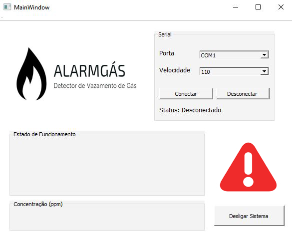

# AlarmGás - Detector de Vazamento de Gás Inflamável
### Manual para utilização do AlarmGás (Projeto desenvolvido para a disciplina de Técnicas de Programação, utilizando o Qt Creator e com uma interface Web)

### O que é o AlarmGás - Detector de Vazamento de Gás Inflamável?

O AlarmGás é um detector de vazamento de gás inflamável. É basicamente um dispositivo que detecta uma alta concentração de gás e de fumaça em um ambiente. Temos como objetivo através de nosso dispositivo, verificar a concentração do gás no ambiente e também alertar a você usuário de maneira luminosa, sonora e visualmente a ocorrência de um vazamento de gás.

### Como utilizar o AlarmGás?

A interface do AlarmGás é bem simples e de fácil entendimento, em sua tela inicial temos os seguintes campos: Serial, Estado de Funcionamento, Concentração (ppm) e um botão Desligar Sistema. A seguir falaremos sobre cada um deles.

### Serial/Conecção

Para utilizar o nosso sistema, é importante primeiramente fazer a conecção com a ESP presente em nosso circuito. Para isto, se faz necessário selecionar a porta USB através da combobox "Porta" e em seguida selecionar a velocidade através da combobox "Velocidade" (OBS.: Para que funcione perfeitamente, selecione a velocidade 11XXXXX).

