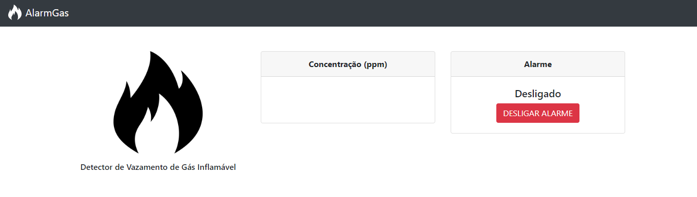

# AlarmGás - Detector de Vazamento de Gás Inflamável
### Manual para utilização do AlarmGás (Projeto desenvolvido para a disciplina de Técnicas de Programação, utilizando o Qt Creator e com uma interface Web)

### O que é o AlarmGás - Detector de Vazamento de Gás Inflamável?

O AlarmGás é um detector de vazamento de gás inflamável. É basicamente um dispositivo que detecta uma alta concentração de gás e de fumaça em um ambiente. Temos como objetivo através de nosso dispositivo, verificar a concentração do gás no ambiente e também alertar a você usuário de maneira luminosa, sonora e visualmente a ocorrência de um vazamento de gás.

### Como utilizar o AlarmGás?

A interface do AlarmGás é bem simples e de fácil entendimento. Em sua tela inicial temos os seguintes campos: Serial, Estado de Funcionamento, Concentração (ppm) e um botão Desligar Sistema. A seguir falaremos sobre cada um deles.

### Serial/Conecção

Para utilizar o nosso sistema, é importante primeiramente fazer a conecção com a ESP presente em nosso circuito. Para isto, se faz necessário selecionar a porta USB através da ComboBox "Porta" e em seguida selecionar a velocidade através da ComboBox "Velocidade" (OBS.: Para que funcione perfeitamente, selecione a velocidade 115200).

Após selecionada a porta e a velocidade, basta clicar no botão "Conectar" e você estara conectado. Caso deseja desconectar, utilize o botão "Desconectar". O "Status" mostra a situação atual da conecção.

### Estado de Funcionamento

Em Estado de Funcionamento, você consegue obsevar em que situação se encontra o dispositivo. Neste campo será mostrado duas mensagens. A primeira mensagem diz: "Em funcionamento...", ou seja, o dispositivo está funcionando e não a vazamento de gás ou detecção de fumaça no ambiente.

A segunda mensagem diz: "PERIGO! XXXXXXXXXXXXXXXX", está mensagem indica que o dispositivo detectou uma alta concentração de gás ou fumaça no ambiente.

### Concentração (ppm)

Na tela da Concentração, você pode acompanhar o valor da concentração de gás presente no ambiente. É importante destacar que se a concentração for superior a XX700XX você será alertado.

### Desligar Sistema

### Como utilizar o AlarmGás Web?

Na interface Web, temos os seguintes campos: Concentração(ppm) e Alarme (Status de funcionamento e botão Desligar Alarme). A seguir falaremos sobre cada um deles.

